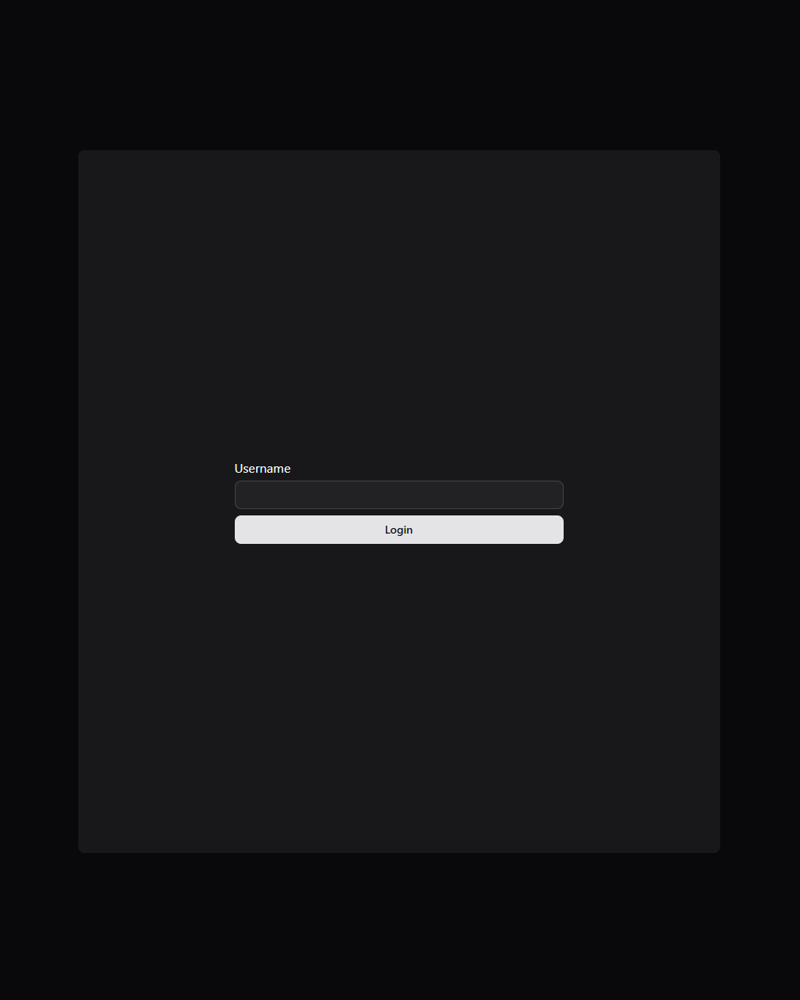
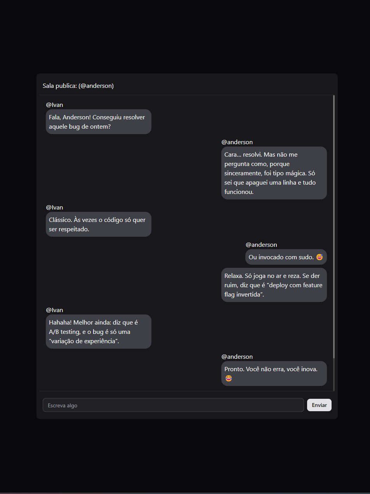

Claro! Aqui está uma versão ajustada, com melhorias de formatação em Markdown, correções de português e um estilo mais bonito e organizado:

---

# 🚀 Desafio CodeCon #03

## ⏱️ Regras
- **30 minutos** para planejamento  
- **4 horas** para desenvolvimento

---

## 🎯 Objetivo
Criar um **chat multiusuário** em tempo real.

---

## 🛠️ Tecnologias Utilizadas

### 🔧 Backend
- [.NET](https://dotnet.microsoft.com/)

### 💻 Frontend
- [React](https://react.dev/)
- [Shadcn UI](https://ui.shadcn.com/)
- [Tailwind CSS](https://tailwindcss.com/)

---

## 🧾 Minha Declaração sobre o Desafio

O desafio não foi muito complexo, mas foi **bastante interessante**.  
Inicialmente, pensei em fazer o backend com Node.js pela rapidez no desenvolvimento, já que o tempo era limitado. No entanto, optei por utilizar **.NET** para aprimorar ainda mais meus conhecimentos nessa stack, já que atualmente trabalho com **.NET e React**.

O que mais consumiu meu tempo foi o **frontend** — especialmente a **organização dos componentes**, estrutura do layout, definição das **regras de negócio**, e o provisionamento do **contexto global com hooks personalizados**.

Utilizei **Tailwind CSS** para agilizar o desenvolvimento visual e o **Shadcn UI**, que particularmente gosto muito por oferecer componentes minimalistas e com um design que me agrada bastante.

A construção do backend foi bem tranquila. Com o uso da biblioteca `Microsoft.AspNetCore.SignalR`, a comunicação em tempo real ficou muito simples.  
No frontend, utilizei a biblioteca `@microsoft/signalr`, que facilitou bastante a conexão com a API criada.

---

## 📈 Conclusão

Consegui utilizar 100% do tempo disponível e atingi o **MVP** com sucesso.  
Gostaria de ter implementado mais funcionalidades, mas pretendo **evoluir esse projeto** em um desafio pessoal futuramente.

---

## 🖼️ Resultado Final

### 🔐 Login  

### 💬 Chat  
